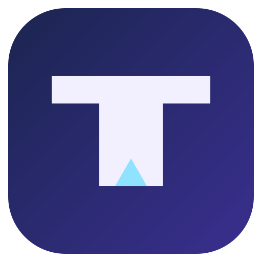
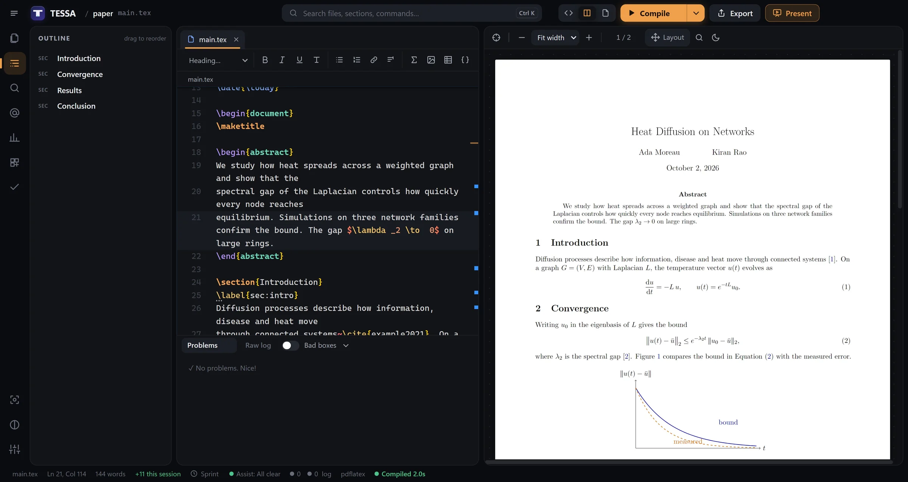
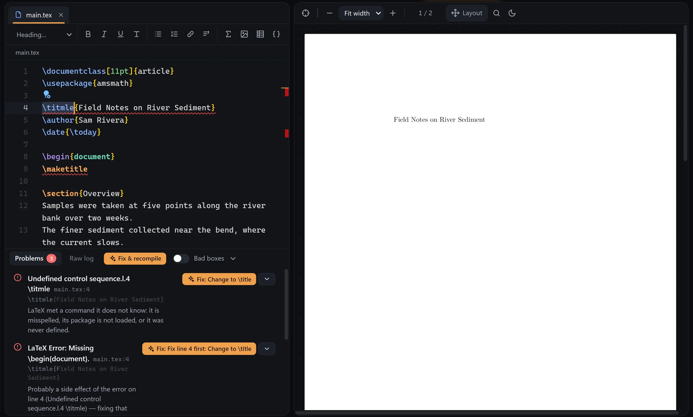
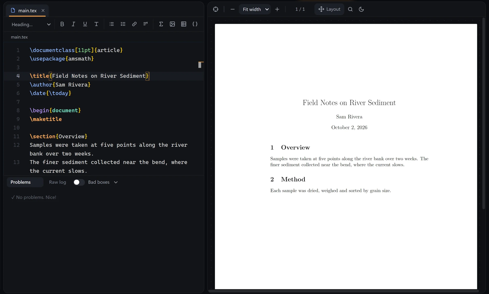

  

<h1 align="center">TESSA</h1>

  <b>Stop debugging. Start writing.</b> 
  A free LaTeX studio for Windows that explains your errors in plain English and fixes them in one click.

  <a href="https://github.com/edith-lang/tessa/releases/latest"><b>Download for Windows</b></a>
  &nbsp;·&nbsp;
  <a href="https://edith-lang.github.io/tessa/">Website</a>
  &nbsp;·&nbsp;
  <a href="https://edith-lang.github.io/tessa/#video">Watch the 3 minute tour</a>

  

## Why TESSA

LaTeX makes beautiful documents. It also makes cryptic errors, endless logs and lost evenings. TESSA keeps the beauty and removes the pain.

| | |
|---|---|
| **Errors explained, then fixed** | Every error comes with a plain English explanation and a fix. Press **Fix all** and TESSA repairs them and compiles again. |
| **Live PDF** | The PDF updates as you type. Click anywhere to jump between the source and the page. |
| **Layout mode** | Press **Ctrl L** and drag charts, images and text boxes right on the PDF. TESSA rewrites the LaTeX for you. |
| **Equations** | Type math and watch the preview build. Shortcuts like `@a` for `\alpha` and `//` for a fraction. |
| **Tables** | Paste cells from Excel or Sheets and get a clean table. Edit any table like a spreadsheet. |
| **Command palette** | **Ctrl K** finds files, sections, labels, citations, snippets and every command. |
| **Slides** | Write Beamer slides, present full screen, or export to PowerPoint. |
| **Made for beginners** | A short setup asks how much help you want, and an optional 10 minute tour teaches the essentials by doing them. |

  
  

## Download

| Version | For | Size |
|---|---|---|
| [**Installer**](https://github.com/edith-lang/tessa/releases/download/v3.0.0/TESSA-Setup-3.0.0.exe) (recommended) | Windows 10 and 11, 64 bit. No admin rights needed. | 97 MB |
| [**Portable**](https://github.com/edith-lang/tessa/releases/download/v3.0.0/TESSA-3.0.0-portable.exe) | Runs without installing. | 96 MB |

LaTeX comes built in, so there is nothing else to install. If you already have TeX Live or MiKTeX, TESSA uses them automatically.

TESSA is not code signed yet, so Windows may show **Windows protected your PC** the first time. Choose **More info**, then **Run anyway**. Checksums for every file are on the [release page](https://github.com/edith-lang/tessa/releases/latest).

## Private by design

TESSA has no servers, no account and no analytics. Your projects stay in your Documents folder. It only goes online to fetch a LaTeX package it does not have yet, or when you look up a reference by DOI. It never sends your documents anywhere.

Read the full [privacy policy](https://edith-lang.github.io/tessa/privacy.html).

## Questions

**Is it really free?**
Yes. Free for personal, school and commercial work. Everything you create belongs to you.

**Is it open source?**
No. TESSA is freeware: free to use, but not to modify, reverse engineer or resell. It is built on open source components, listed in the [third party notices](https://edith-lang.github.io/tessa/notices.html).

**I am new to LaTeX. Is it for me?**
Yes. That is exactly who it is made for.

## About this repository

This repository hosts the TESSA website and its releases. The website is served from here as [the TESSA website](https://edith-lang.github.io/tessa/). The app itself is distributed through [Releases](https://github.com/edith-lang/tessa/releases).

## License

Freeware. See [LICENSE](LICENSE) for the full terms.

© 2026 Adithyan Lalu. Contact: adhy092018@gmail.com
